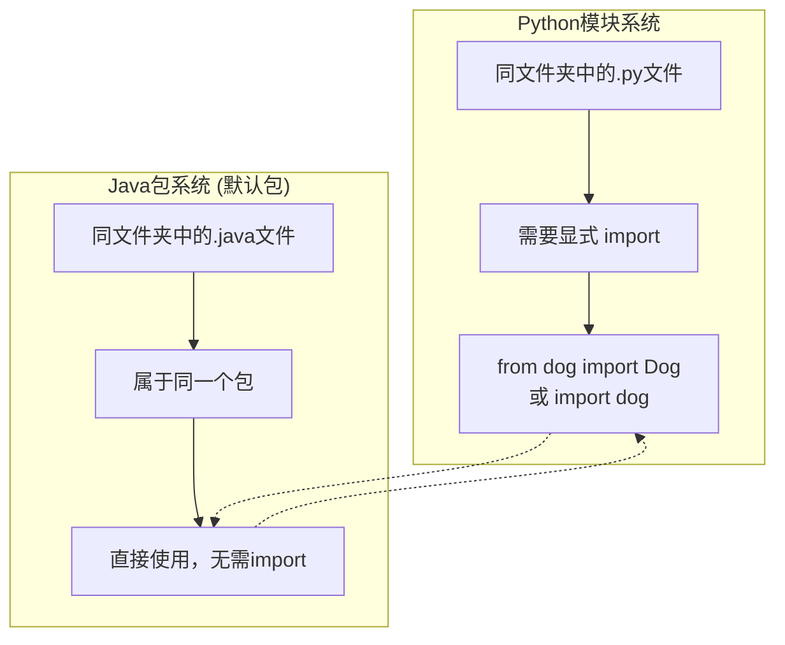

## Unit Testing with JUnit and LntLists

### 1. 项目架构调试错误

1. 项目范围设置错误：导入了整个 `CS61B` 文件夹作为项目，应该导入单独的文件夹
2. 源根目录配置混乱
3. 输出路径未配置
4. 语言级别不匹配

#### 正确流程

**明确项目边界**：

- 每个lab/homework应该是独立项目
- 不要把整个课程文件夹当作一个项目

```
lab2setup/           <- 这是项目根目录
├── Dog.java         <- 源代码直接在根目录
├── DogTest.java     
├── out/             <- 编译输出
└── .idea/           <- IDE配置文件
```

​	项目、模块：小项目通常只有一个模块，而不是占用整个工作空间。所以项目中可添加多个模块

#### **Java类查找机制**

Classpath，类路径。在写 `Dog d = new Dog(3);` 时，Java编译器需要：

1. **找到Dog类的定义**（Dog.java文件）
2. **将其编译为字节码**（Dog.class文件）  
3. **建立引用关系**

那为什么DogTest能调用Dog类？1. Dog是public的，其他类可以访问它；2.在同一个文件夹中，Java认为他们在同一个包中，通报中的public可以互相访问

##### **Java包系统 vs Python模块系统**



Java包规则：

- **同一文件夹** = **同一包**（如果没有package声明）
- **同一包内的类可以直接使用**，无需import

这就是为什么DogTest能直接用Dog类

那如何在复杂项目中避免混乱？在实际项目中，**不会**把所有类放在一个文件夹中。

```
src/
├── com/
│   └── company/
│       └── project/
│           ├── model/
│           │   ├── User.java          // package com.company.project.model;
│           │   └── Product.java       // package com.company.project.model;
│           ├── service/
│           │   ├── UserService.java   // package com.company.project.service;
│           │   └── ProductService.java
│           ├── controller/
│           │   └── UserController.java // package com.company.project.controller;
│           └── util/
│               └── DateUtil.java      // package com.company.project.util;
└── test/
    └── com/
        └── company/
            └── project/
                └── UserTest.java      // package com.company.project;
```

### 2. 代码调试

#### `divideThenRound` - 小数被截断

- 期望 `7 / 2` 得到 `3.5` 再四舍五入为 `4`，但结果却是 `3`。
- 问题的根本原因：整数除法 (Integer Division)。在Java（以及许多其他编程语言）中，当一个整数除以另一个整数时，计算机会执行整数除法。这意味着结果也必须是一个整数，所有的小数部分都会被直接丢弃（截断），而不是四舍五入。
  - 在代码 `float quotient = top / bottom;` 中，`top / bottom` 的计算先于赋值。因为 `top` 和 `bottom` 都是 `int`，所以 `7 / 2` 的结果是整数 `3`。然后，这个整数 `3` 才被转换成浮点数 `3.0f` 赋值给 `quotient`。
- **基础概念**：**数据类型决定运算行为**。计算机对不同数据类型的处理方式是不同的。想要得到浮点数结果，就必须在运算发生前，将至少一个操作数转为浮点类型，如 `(float) top / bottom`。

#### 非运算符实现add和max方法

1. max

   利用符号位来实现，负数的最高位（符号位）是1，非负数（0和正数）的最高位是0。通过右移操作 `>>`，得到一个全0（`0`）或全1（`-1`）的掩码（mask），然后用这个掩码来选择想要的数字。

​	**`int w = (b - a) >> 31;`**

​		`b - a`：计算两个数的差。

​	**`int z = ~(b - a) >> 31;`**

​		`~`：这是按位取反操作，它会翻转一个数的所有二进制位（0变1，1变0）。

​	**`int min = b & w | a & z;`**

​		`&` 是按位与，`|` 是按位或。任何数 `x & 0` 的结果是 `0`；任何数 `x & -1` (全1) 的结果是 `x` 本身。

2. add

   模拟加法过程：

   A. 计算“本位和” -> 使用 `异或 (XOR, ^)`，**相同为0，不同为1**。这恰好就是二进制加法中不考虑进位的结果

   B. 计算“进位值” -> 使用 `与 (AND, &)` 和 `左移 (<<)`。**`左移 (<< 1)` 操作的作用就是将一个二进制数的所有位向左移动一位，这在数值上等同于乘以2，也恰好就是将进位放到了它应该在的下一列**

```java
while (b != 0) { // 只要还有进位值，就继续循环
    // 1. 计算进位值，并把它移动到正确的位置
    int carry = (a & b) << 1;
    
    // 2. 计算不带进位的“本位和”
    a = a ^ b;
    
    // 3. 将进位值赋给b，准备下一轮相加
    b = carry;
}
return a; // 当没有进位时，a就是最终答案```
```

